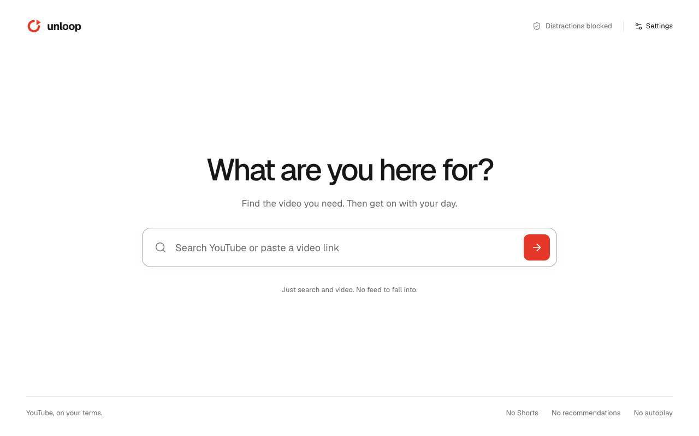

# Unloop

**You came for one video.** A free Chrome extension that makes YouTube useful without the endless feed.

[Website](https://blackridder22.github.io/unloop/) · [Download](https://github.com/blackridder22/unloop/releases/latest/download/unloop-chrome.zip) · [Report an issue](https://github.com/blackridder22/unloop/issues)



## Install

1. Download the release ZIP and extract it into a permanent folder.
2. Open `chrome://extensions` and turn on **Developer mode**.
3. Click **Load unpacked** and select the extracted folder.
4. Reload YouTube. Pin Unloop for a search shortcut.

This version is installed manually, not through the Chrome Web Store. To update, replace the contents of the folder you originally loaded and click **Reload** on the extension. Keeping that folder preserves its extension ID and preferences. Unloop succeeds the earlier Intentional prototype and retains its stored preferences.

## Features

- Opening YouTube starts with a purposeful search page.
- Watch videos with YouTube’s native player, captions, speed, seeking, and fullscreen.
- Keep descriptions in their own box, including links, chapters, expansion, and credits.
- Keep native creator details and actions, including account-dependent menus.
- Visit any creator’s **Videos**, **Live**, and **Playlists**. Creator Home opens Videos.
- Browse playlists and choose videos manually, without an automatic next-video queue by default.
- Choose visibility for descriptions, creators, actions, comments, recommendations, home feed, Shorts, and autoplay.
- Choose **Light**, **Dark**, or **System** appearance. Settings apply across open tabs.
- Follow channel-description redirect links to their intended web destinations.
- Animated switches use 160 ms transform/opacity transitions. Keyboard changes are immediate; reduced motion removes the slide.

Description, creator details, and actions are on by default. Feeds, comments, recommendations, Shorts, and autoplay are off. Restore defaults resets visibility and appearance.

## Privacy and scope

Unloop stores preferences locally. It adds no analytics, accounts, remote scripts, AI classification, or stored browsing history. Fonts are bundled. YouTube’s own data practices and advertisements still apply.

Permissions: `storage` saves preferences; `declarativeNetRequest` redirects restricted routes. Host access is limited to YouTube, youtu.be, and youtube-nocookie domains. Native account actions remain YouTube controls. Embedded players on unrelated websites are outside scope. YouTube markup changes may require selector updates.

## Develop

Requires Node.js 22 or newer.

```sh
npm ci
npm run dev
npm run typecheck
npm test
npm run build
npm run zip
npm run dev:site
npm run build:site
```

Load `.output/chrome-mv3` for development. The landing page builds to `dist-site` and deploys through GitHub Actions.

### Browser checks

```sh
npx playwright install chromium
npm run build
npm run test:settings
npm run test:motion
npm run test:theme
npm run test:browser
```

Settings and motion checks use isolated Chromium profiles with controlled fixtures. The theme and general browser checks also reach live YouTube and may encounter sign-in or bot checks. Fixture results do not prove signed-in account actions. Screenshots are local evidence and are not committed.

The optional playback fixture requires ffmpeg:

```sh
ffmpeg -y -f lavfi -i color=c=0x171717:s=640x360:r=24:d=2 -c:v libvpx -b:v 80k -an /tmp/intentional-fixture.webm
npm run test:fixture
```

## Architecture

- `lib/policy.ts`: URL and route policy.
- `entrypoints/background.ts`: browser rules and toolbar action.
- `entrypoints/youtube.content/`: native YouTube layout and playback controls.
- `entrypoints/search/` and `entrypoints/options/`: extension screens.
- `site/`: public landing page; settings demo is independent of extension preferences.

Built with [WXT](https://wxt.dev/), React, and [blackridder22UI](https://ui.blackridder22.dev/llms.txt). Original layouts were designed in Paper. The landing page uses locally bundled assets, a real extension screenshot, and generated brand artwork.

## License

[MIT](LICENSE). See [third-party notices](THIRD_PARTY_NOTICES.md) for component and font licenses.
